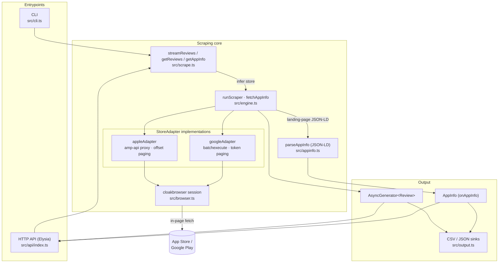
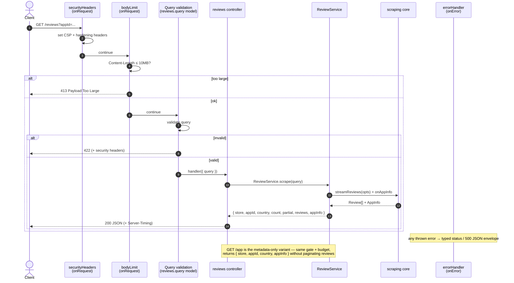
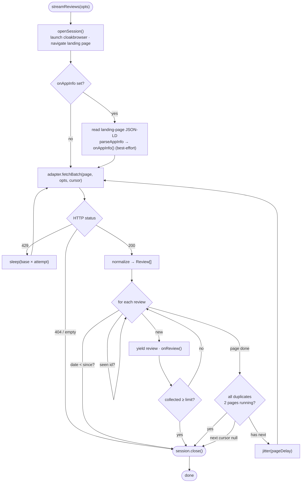
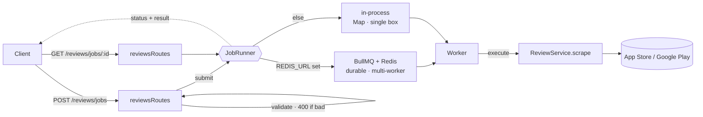
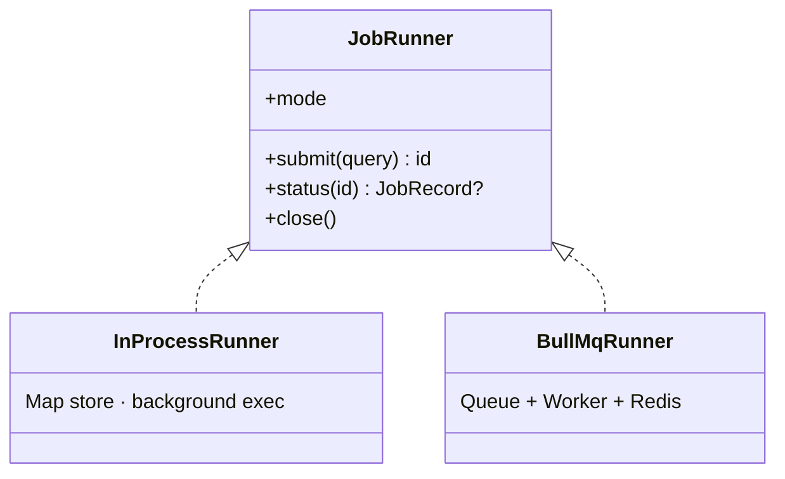

# noviq — Application Flow

Visual reference for how noviq is wired together. Two entry points (CLI and
HTTP API) feed the same scraping core; the core hides each store behind a single
`StoreAdapter` interface and drives a humanized cloakbrowser session.

## 1. System architecture



## 2. API request lifecycle

Cross-cutting concerns are global Elysia plugins; the controller stays thin and
delegates to the service.



## 3. Scraping engine loop

`runScraper` is store-agnostic: it manages the session, de-duplication,
`limit`/`since` cutoffs, jittered delays and 429 backoff. Each adapter only
implements `landingUrl`, `initialCursor` and `fetchBatch`.



## 4. StoreAdapter abstraction

Adding a store is one new adapter — no engine changes.

```mermaid
classDiagram
  class StoreAdapter~C~ {
    +store: Store
    +initialCursor: C
    +landingUrl(opts) string
    +fetchBatch(page, opts, cursor) FetchResult~C~
  }
  class appleAdapter {
    cursor = number (offset)
  }
  class googleAdapter {
    cursor = { token }
  }
  class runScraper {
    +manages session, dedup, limit, since, backoff
  }
  StoreAdapter <|.. appleAdapter
  StoreAdapter <|.. googleAdapter
  runScraper ..> StoreAdapter : drives
```

## 5. Async jobs (pluggable runner)

`POST /reviews/jobs` enqueues; a worker runs the same `ReviewService.scrape`;
clients poll `GET /reviews/jobs/:id`. The backend is chosen by config.




