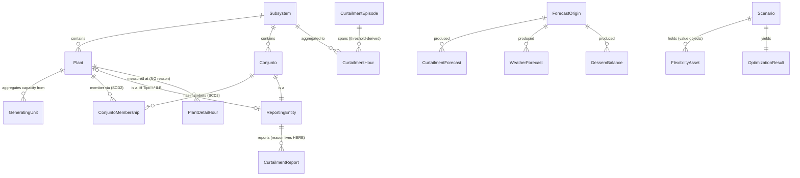

# WattSteer — Domain Model and Ubiquitous Language

> The nouns. Every later spec, table, endpoint, feature name and screen label
> uses these words and only these words.
>
> **Evidence base.** This document *decides*; it does not re-establish facts.
> Everything factual traces to the research files, which remain the authority:
> [`research/ons-datasets.md`](research/ons-datasets.md) ·
> [`research/plant-registry.md`](research/plant-registry.md) ·
> [`research/weather-lead-time.md`](research/weather-lead-time.md) ·
> [`research/weather-sources.md`](research/weather-sources.md) ·
> [`research/optimizer-formulation.md`](research/optimizer-formulation.md).
>
> Ticket: [`006-domain-model.md`](../.wayfinder/tickets/006-domain-model.md).
> Map: [`.wayfinder/map.md`](../.wayfinder/map.md).
> [`specs/data-platform.md`](specs/data-platform.md) predates this document and
> uses working names; where they differ, **this document wins** and the
> divergences are listed in [Renames against the data-platform spec](#renames-against-the-data-platform-spec).

## Naming rules

1. **Identifiers are English.** UI language is a separate, settled concern
   (bilingual PT-BR / EN, all strings externalised). No identifier is ever
   Portuguese *because* the screen will show Portuguese.
2. **ONS's proper nouns survive untranslated**: `conjunto`, `constrained-off`,
   `DESSEM`, the subsistema display names (`SUDESTE/CENTRO-OESTE`), the reason
   codes (`REL`/`CNF`/`ENE`/`PAR`) and the origin codes (`LOC`/`SIS`). These
   name *specific Brazilian grid artefacts*; translating them would invent a
   concept that does not exist.
3. **No Portuguese-English hybrids.** `usina` becomes `plant`; `usina_id` and
   `conjunto_membership` are not both acceptable — `conjunto` stays because it
   is rule 2, `usina` goes because `plant` is an exact translation.
4. **Raw source values are data, not identifiers.** `CJU_MAPLN`, `SE`, `SECO`,
   `EOLIELÉTRICA` are stored verbatim where they are keys; they never become
   column or type names.
5. **Prefer names that make illegal states unrepresentable.** Where a rule can
   be enforced by shape instead of discipline, it is — sum types over nullable
   discriminators, derived functions over stored columns, absent columns over
   columns that must never be filled.

---

## 1. Time, vintage and the three axes

This is the vocabulary every other section depends on, so it comes first.

Every fact WattSteer stores has **three** independent times. Naming them
consistently is the single highest-leverage decision in this document, because
two of them are routinely conflated in energy systems and the third does not
exist in most.

| Name | Meaning | Example |
|---|---|---|
| **`valid_time`** | The instant in the world the fact is *about*. UTC. Always the **start** of the interval it describes. | The hour 2026-08-28T14:00Z that was curtailed. |
| **`published_at`** | The instant the **upstream source** asserted this value. | The ECMWF run initialisation 2026-08-27T12:00Z; the DESSEM file's creation; the ONS file's `Last-Modified`. |
| **`ingested_at`** | The instant **WattSteer** learned it. | When the worker wrote the row. |

**`valid_time` is not `event_time`.** The word *event* is reserved for a
different concept in this domain (see [§5](#5-curtailmenthour-and-curtailmentepisode)),
and every hour of grid data is not an "event". This renames the map's charting
note; see [Renames](#renames-against-the-data-platform-spec).

**Vintage** is the noun for the pair `(published_at, ingested_at)` — "which
version of the truth this row is". It is not a column.

- `published_at` is **never null**. Where the source does not stamp rows, the
  adapter supplies the coarsest honest stamp it has: the S3 `Last-Modified` for
  ONS bulk files, `din_atualizacao` for `cargaverificada` rows (the one true
  row-level marker in ONS data), the run initialisation time for weather, the
  file creation time for DESSEM. The adapter records **which** it used in
  `published_at_precision` ∈ `row` | `file` — an honest coarseness marker, not
  a nullable field.
- `data_version` is a monotonic integer per business key, incremented **only
  when the stored value tuple actually changes**. A re-ingest that reproduces
  identical values does not bump it. Vintage history records ONS restatements,
  not WattSteer's polling schedule.

**`AsOf(t)`** is the only sanctioned read of a fact table: the row per business
key with the greatest `ingested_at ≤ t`. Exactly one row per key, or none.
Nothing downstream reads a fact table without an as-of.

**`VintageFidelity`** — an enum stamped on every backtest, replay and metric:

- `point_in_time` — the whole window post-dates WattSteer's ingestion go-live,
  so `AsOf` returns what was genuinely knowable.
- `revision_optimistic` — the window predates go-live, so the "past" is ONS's
  *current* restatement of it. ONS rewrites history in place and prior vintages
  are unrecoverable, so this can never be repaired retroactively.

This is a product-visible term, not an internal one. Any surface reporting a
metric over a `revision_optimistic` window must say so.

**Interval convention.** One canonical grain for analytics: the **hour**,
UTC, start-labelled. Sources disagree (constrained-off and balanço label the
start; the carga API and DESSEM `num_patamar` label the end) and the difference
is exactly one half-hour. Adapters resolve it; nothing downstream of an adapter
ever sees an end-labelled interval or a Brasília-local timestamp.

**Energy is stored; power is derived.** Canonical storage is **MWh**. At the
canonical hourly grain MWh and MW are numerically identical, which is why the
distinction is easy to lose and why it is stated here: a column named `*_mwh`
holds energy, a column named `*_mw` holds instantaneous or nameplate power
(installed capacity, an asset's rating), and MWmed source values are converted
using the source interval length at the boundary — never later.

---

## 2. Grid geography

### `Subsystem`

**An enum, not a table.** Exactly four members, with WattSteer's canonical
codes:

| Code | ONS display name |
|---|---|
| `N` | NORTE |
| `NE` | NORDESTE |
| `S` | SUL |
| `SE` | SUDESTE/CENTRO-OESTE |

- The canonical code is ONS's bulk-file code. The carga REST API's `SECO` is a
  **transport-layer detail owned by that adapter** — it appears in one HTTP
  client and nowhere else. (`SE` against that API returns HTTP 200 and an empty
  array; the mapping is a correctness requirement, not a convenience.)
- Padding (`` `SE ` ``) and leading-space display names are adapter concerns.
- **`SIN` is not a Subsystem.** It is a national aggregate row that ONS mixes
  into `balanco-energia-subsistema`, and it is filtered at the boundary. If a
  national total is ever needed it is a *derived sum over the four*, never a
  fifth enum member. Making `SIN` unrepresentable as a Subsystem is what makes
  double-counting impossible rather than merely discouraged.
- **`Subsystem` carries no capacity.** Installed capacity is a function of
  time, not an attribute (see `InstalledCapacityAsOf`).

Sub-subsystem geography is out of scope by the map (no state grain — load and
exchange are not published per state). `state` survives only as a **plant
attribute**, taken from ONS's electrical assignment, and is never used to derive
a subsystem.

### `Technology`

Enum: `wind` | `solar`. Maps ONS `EOLIELÉTRICA` / `FOTOVOLTAICA`. Two members
only — WattSteer forecasts VRE curtailment, and hydro/thermal appear solely as
context quantities inside the energy balance.

---

## 3. The fleet: Plant, GeneratingUnit, Conjunto, ReportingEntity

This is the hardest part of the model and the part most likely to be got wrong
by a later session reading the ONS files directly.

### `Plant`

A *usina* — one generating facility.

- **Identity: `ons_plant_code`** (ONS `id_ons`, e.g. `MAEDT1`). This is the key
  that joins across ONS datasets and it is the entity's identity in WattSteer.
- **`ceg_core`** — the ANEEL CEG with the **version segment stripped** (`.1`,
  `.01` — ANEEL writes it unpadded, ONS zero-pads it; verbatim matching is 0 of
  1,614, stripping the version gives 100.00%). This is the bridge to SIGA and is
  a *derived* column; the raw strings from both sides are retained alongside it.
- **Never joined on name.** SIGA writes historical aliases inline
  (`Cerro Chato I (Antiga Coxilha Negra V)`); normalised-exact name agreement
  with ONS is 94.5%. `NomEmpreendimento` is also never rendered raw.
- **Attribute ownership is split by source, and the split is measured**:
  ONS owns subsystem, state, technology, operation modality, capacity and
  commissioning/deactivation dates; **SIGA contributes only** `latitude`,
  `longitude`, `municipality` and `ownership`. (SIGA lags new entrants — twelve
  plants were being curtailed while SIGA still showed them as `Construção` at
  0 kW.)
- **Coordinates are `Option<Coordinate>`, not a nullable pair.** 1.72% of SIGA
  rows sit at exactly (0.0, 0.0) — Null Island. A coordinate outside the Brazil
  bounding box (lat −34…+6, lon −74…−33), zeros included, is *absent*, and the
  municipality centroid is the fallback. Non-null is not valid.

### `GeneratingUnit`

One turbine or inverter block — the true grain of ONS `capacidade-geracao`.
Exists as an entity for exactly one reason: **`InstalledCapacityAsOf`**.

`rated_power_mw`, `commissioned_on`, `decommissioned_on` (nullable — nullable
here is correct, it means "still running"). A Plant's capacity is the sum over
its units, never a stored number.

### `InstalledCapacityAsOf(scope, technology, t) → MW`

A **function, not a column**. Sums `rated_power_mw` over units where
`commissioned_on ≤ t < coalesce(decommissioned_on, ∞)`. This is what makes
capacity weights and capacity factors time-varying, which the plant-registry
research settled by measurement: fixed present-day weights misallocate 50.4% of
the SE-solar weight mass at window start and move that centroid 94 km.

Its one caveat is named, not hidden: it reflects *today's record* of the past.
Retroactive corrections to commissioning dates are invisible unless WattSteer
snapshots the file daily — which it does, hence `ingested_at`.

### `Conjunto`

Kept as a Portuguese proper noun by naming rule 2. A **group of Tipo II-C
plants that ONS treats as one settlement unit**. It is a first-class entity, not
a grouping convenience, because it is the *only* grain at which restriction
reasons exist.

- **Identity: `ons_conjunto_code`** (`CJU_MAPLN`). Conjuntos have no CEG — ONS
  writes `"-"` — so `ceg_core` is structurally absent on a Conjunto, not empty.
- 247 conjuntos over the window against 18 self-reporting plants; conjuntos
  account for **98.6%** of all constrained-off energy.

### `ConjuntoMembership`

The `usina_conjunto` bridge, and it is **SCD2**:
`(plant, conjunto, member_from, member_to)`.

- **Membership is time-resolved and must always be resolved as of a date.** A
  plant that joined mid-window is misattributed by any snapshot join.
- **Invariant, asserted on ingest rather than assumed:** a Plant belongs to at
  most **one** Conjunto at any instant. Overlapping intervals for one plant are
  an ingest failure, not a merge. (1,789 membership rows cover 1,630 distinct
  plants — the surplus is expected to be *sequential* membership; the assertion
  is what proves it.)
- The `_detail` files carry `nom_conjuntousina` and `nom_modalidadeoperacao`
  inline, so a plant's conjunto and modality are readable without the bridge.
  The bridge is still authoritative, because only it is time-resolved.

### `ReportingEntity` — the key type

**A sum type: `ReportingEntity = Conjunto | SelfReportingPlant`.**

This is the row key of the entity-grain constrained-off datasets (ONS `id_ons`,
which is a `CJU_*` code for Tipo II-C and a plant code for Tipo I / II-B). It is
the grain at which ONS *settles* curtailment, and therefore the only grain at
which a reason exists.

Modelling it as a sum type rather than as "a plant that might be a conjunto"
is what makes the central invariant structural:

> **A restriction reason is a property of a `ReportingEntity`. There is no path
> in the type system from a `Plant` to a reason.**

Two consequences worth stating plainly, because they are easy to get subtly
wrong in opposite directions:

1. For a **Tipo II-C** plant — 93% of wind rows, 98.6% of curtailed energy —
   the reason is genuinely unknown at plant grain. Deriving one is an
   **allocation**, and v1 does not compute one at all. If a future screen wants
   it, it is a named `ReasonAllocation` with a stated method, labelled as an
   estimate.
2. For a **`SelfReportingPlant`** (Tipo I / II-B — 18 plants over the window)
   the reason *is* observed at plant grain, because that plant is itself the
   reporting entity. Suppressing it would be a different dishonesty. Screens
   must therefore label the **grain**, not assume it: "reason for
   *conjunto X*" / "reason for *plant Y*". See
   [Calls the dev should review](#calls-the-dev-should-review).

`OperationModality` — `TIPO_I` | `TIPO_II_A` | `TIPO_II_B` | `TIPO_II_C` — is a
plant attribute and is what determines which variant a plant participates in.

---

## 4. Facts: Observation and Forecast

### The distinction, made structural

`Observation` and `Forecast` are **two types, and two table families** — not one
table with a `horizon` column. The discriminator is not a flag:

> An **`Observation`** always has `published_at > valid_time`.
> A **`Forecast`** always has `published_at < valid_time`.

A `Forecast` additionally carries a `ForecastOrigin`; an `Observation` cannot,
because there is no run that produced it. That structural difference is what
prevents a forecast being read as an actual — the failure the data-platform
spec calls out for DESSEM specifically, generalised.

`lead_time = valid_time − published_at` is **derived, never stored**. Storing it
would permit a row whose lead time disagrees with its own timestamps.

### `ForecastOrigin`

`{ producer, run_label, published_at }` — the identity of the run that produced
a forecast.

| Producer | `run_label` | `published_at` |
|---|---|---|
| `open_meteo` | `00Z` / `12Z` | run initialisation time |
| `ons_dessem` | the DESSEM reference day | file creation (D−1 evening) |
| `wattsteer` | model artifact version | inference time |

Because `published_at` *is* the run initialisation, the settled decision that
the D−1 12Z run supersedes the D−1 00Z run needs no special case: it is simply a
newer vintage of the same valid hours. **Every surface that shows a forecast
must name its `ForecastOrigin`.**

### The observed quantities

Constrained-off, at `ReportingEntity` grain (ONS datasets 1 & 3 — the
*apuração* view):

| Name | Source | Notes |
|---|---|---|
| `constrained_off_mwh` | `val_geracaolimitada` | **The primary label.** Energy the entity was instructed not to generate. |
| `verified_generation_mwh` | `val_geracao` | |
| `reference_generation_mwh` | `val_geracaoreferencia` | What generation *would* have been. |
| `final_reference_generation_mwh` | `val_geracaoreferenciafinal` | The settled restatement of the above. |
| `available_capacity_mw` | `val_disponibilidade` | Real-time availability; power, not energy. |
| `restriction_cause` | see below | Nullable *as a whole*. |

At `Plant` grain (ONS datasets 2 & 4 — the `_detail` view). **No reason code and
no reference generation exist here; curtailment volume cannot be computed from
these files:**

| Name | Source |
|---|---|
| `estimated_generation_mwh` | `val_geracaoestimada` |
| `verified_generation_mwh` | `val_geracaoverificada` |
| `measured_wind_speed_ms` | `val_ventoverificado` (ONS's dictionary says m³/s; it is m/s — a documentation defect, not reproduced) |
| `measured_irradiance_wm2` | `val_irradianciaverificado` |
| `measurement_invalid` | `flg_dadoventoinvalido` / `flg_dadoirradianciainvalido` — one boolean; the wind files encode `0.0` and the solar files `False`, permanently, and the adapter unifies them |

System context, at `Subsystem` grain: `load_mwh`, `wind_generation_mwh`,
`solar_generation_mwh`, `hydro_generation_mwh`, `thermal_generation_mwh`,
`net_exchange_mwh`.

### `RestrictionCause` — a value object, not three columns

```
RestrictionCause {
  reason:      ReasonCode          // REL | CNF | ENE | PAR
  origin:      RestrictionOrigin   // LOC | SIS
  description: string | null       // dsc_restricao, free text
}
```

Modelled as **one nullable value object rather than three nullable columns**,
because `cod_razaorestricao` and `cod_origemrestricao` are populated together
and blank together — exactly, on every file scanned. Half-populated is an
illegal state, and this shape removes it.

`ReasonCode`, verbatim from the ONS dictionary with an English gloss for UI
copy only — **the code is the identifier**:

| Code | ONS definition | English gloss |
|---|---|---|
| `REL` | Razão de indisponibilidade externa (elétrica) | External (grid) unavailability |
| `CNF` | Razão de atendimento a requisitos de confiabilidade | Reliability requirement |
| `ENE` | Razão energética | Energetic (oversupply) |
| `PAR` | Restrição indicada no parecer de acesso | Access-opinion restriction |

`REL` is **not** "relaxamento". It is grid unavailability.

**`PAR` is a live enum member with no observations.** It was added to the domain
2024-04-11 and was seen zero times across five sampled months. It is therefore:
valid on ingest (an adapter that rejects it is broken); **not** a modelling
class in v1 (the classifier's class set is derived from observed data, not from
the enum); and a monitoring signal — its first appearance is worth noticing.
It is neither dead code nor a class to train on.

`RestrictionOrigin`: `LOC` (local) | `SIS` (systemic).

`description` is high-cardinality free text naming a specific network element or
SGI ticket, with inconsistent formatting. It is **displayable evidence, never a
vocabulary**: nothing is grouped, filtered or trained on it.

### `DessemBalance`

A `Forecast` produced by ONS, at 30-minute × `Subsystem` grain, published D−1.
Its own table, never merged with actuals. Carries a full `ForecastOrigin`. The
`num_patamar` → wall-clock mapping is **empirically established, not documented
by ONS** (patamar *k* = the half-hour *ending* at 00:00 + k×30 min Brasília) —
so the adapter asserts the alignment rather than assuming it.

DESSEM is an A/B, not an assumption: its history starts 2025-05-23, so a
DESSEM-conditioned model sees a 15-month window against the full 2024-04→now.
This is a modelling fact recorded here because it constrains what the noun can
be used for.

### `WeatherObservationPoint` / `WeatherForecast`

Weather enters at **cluster centroids** (capacity-weighted aggregation points),
not at plants. `WeatherForecast` rows are `Forecast`s with an `open_meteo`
`ForecastOrigin` from the **Single Runs** API at a pinned model — never the
stitched archive (measured train/serve gap: `wind_speed_120m` RMSE 4.38 km/h
against a field sd of 8.87, a dispersion gap rather than a bias) and never
`best_match`, which silently substitutes models between leads.

`CapacityWeight(centroid, technology, t)` — derived from
`InstalledCapacityAsOf`, therefore time-varying by construction.

---

## 5. `CurtailmentHour` and `CurtailmentEpisode`

The ticket's sharpest question: is an "event" one hour or a run of hours? The
answer is that they are **two different nouns and the word "event" names
neither**.

### `CurtailmentHour`

**The atom.** One (`Subsystem`, `Technology`, `valid_time`) with
`constrained_off_mwh`. It is what is stored, what is aggregated and what the
model predicts. Every number in the system is ultimately a sum of these.

### `CurtailmentEpisode`

**A derived view, never a stored table.** A maximal contiguous run of
`CurtailmentHour`s at or above a threshold, at a stated grain:

```
CurtailmentEpisode {
  grain:            Subsystem | ReportingEntity
  technology:       Technology
  started_at        // valid_time of the first hour in the run
  ended_at          // exclusive: valid_time of the first hour below threshold
  duration_hours
  total_mwh
  peak_mw
  threshold_mw      // the parameter that produced it, carried on the object
  max_gap_hours     // likewise
}
```

Episodes are **computed on read** from a parameterised SQL function. They are
not persisted, because persisting them would freeze a threshold into the
database and permit two screens to disagree about what an episode is.

This gives the product the vocabulary its screens want ("three curtailment
episodes yesterday, the longest 6 hours") on top of the hourly grain the model
actually predicts, with no reconciliation layer between them.

### `curtailment_threshold_mw` — the decision

**Configurable, with a committed default, and the default is grain-scoped.**

| Grain | v1 default |
|---|---|
| `Subsystem` | **5 MW** |
| `ReportingEntity` | **1 MW** |

Reasoning, since "make it configurable" is otherwise a non-decision:

- At subsystem grain the fleet is tens of GW across ~150 reporting entities.
  1 MW is inside the rounding noise of that sum — IDEA.md's own objection to
  `threshold = 0` applies at 1 MW too. 10 MW discards real, dispatchable events.
  5 MW is the defensible middle and is the value every artifact stamps until the
  sweep says otherwise.
- The threshold is a property of the **label**, not of the data. Therefore:
  **`has_curtailment` is never a stored column.** It is derived at feature-build
  time from `constrained_off_mwh` and the threshold in force. This is what makes
  it structurally impossible for two parts of the system to hold disagreeing
  thresholds.
- IDEA.md §2 explicitly asks for >1 / >5 / >10 to be tested. The sweep is a
  forecaster-ticket deliverable; the default exists so that nothing is blocked
  waiting for it, and every model card, episode view and screen carries the
  `threshold_mw` that produced its numbers.
- `max_gap_hours` defaults to **0** — no gap tolerance, an hour below threshold
  ends the episode. Configurable on the same footing.

---

## 6. Scenario, flexibility assets, optimization

### `FlexibilityAsset`

A **sum type discriminated by `asset_type`**, and a **value object with no
persisted identity** — ONS publishes no flexibility-asset registry, so these are
user-supplied scenario inputs. Mitigate is a what-if tool, not an inventory.

Common to every variant: `label`, `subsystem`, `max_power_mw`,
`available_from` / `available_to`.

| Variant | Type-specific |
|---|---|
| `Battery` | `energy_capacity_mwh`, `round_trip_efficiency`, `initial_state_of_charge` |
| `ShiftableLoad` | `max_shift_mw`, `shift_window_hours`, `daily_energy_mwh` |

The schema is built to accept `EV`, `DataCentre`, `Electrolyzer` and `HVAC`
later; v1 implements only `Battery` and `ShiftableLoad`. A sum type — rather than one wide struct with
mutually-exclusive nullable fields — is what stops a battery arriving with a
`max_shift_mw`.

### `Scenario`

`{ subsystem, target_date, forecast_origin, assets[], economic_assumptions? }`.

**Not persisted.** The product is public, read-only and has no accounts, so a
Scenario is **URL-encoded** (canonical JSON, base64url) — which makes it
shareable and bookmarkable without inventing storage or identity. A server-side
cache keyed by the hash of the canonical scenario is legitimate and is a
*cache*, not persistence: it may be evicted at any time with no user-visible
loss.

`economic_assumptions` carries the R$/MWh used, because R$ appears only as a
labelled economic scenario with its assumption visible.

### `OptimizationResult`

```
OptimizationResult {
  baseline_curtailment_mwh
  optimized_curtailment_mwh
  avoided_energy_mwh          // baseline − optimized
  avoidability: number | null // avoided / baseline; null when baseline is 0
  dispatch[]                  // per asset, per hour, MW
  state_of_charge[]           // per battery, per hour, MWh
  solver_status
  threshold_mw                // the episode/label parameter in force
  forecast_origin             // which run this was optimised against
}
```

- `avoidability` is **`null`, never 0, when baseline curtailment is zero** —
  the ratio is undefined, and a zero would read as "nothing could be avoided"
  rather than "there was nothing to avoid".
- `avoided_energy_mwh`, past tense: what *this* dispatch achieves under *this*
  scenario. Not a property of the day.
- MWh recovered and % curtailment avoided are the headline KPIs. No carbon
  claim is derivable from this object and none is offered.
- The optimizer is MILP with real binaries and runs synchronously in the HTTP
  request; there is no job, and therefore no `OptimizationJob` noun.

### `Replay` and `Backtest`

**`Replay` is a read mode, not a table** — and that is the whole answer to the
ticket's question about what distinguishes it from an ordinary forecast: *in the
data model, nothing*, deliberately.

A `Replay` is a `Scenario` whose `target_date` is in the past, evaluated with
`AsOf(t)` pinned to the D−1 run's `published_at` for that date, then scored
against the `Observation`s. Because bitemporal storage already makes "what did
we know then" a query, a Replay is that query plus a UI. It carries its
`VintageFidelity`, and for any date before ingestion go-live that value is
`revision_optimistic` and is displayed.

`Backtest` is the distinct noun for the aggregate: metrics over many days,
consumed by the weekly retrain's hot-swap gate. A Replay is one day for a human;
a Backtest is many days for a gate. They share the machinery and not the name.

---

## 7. Relationships



The load-bearing edges, in words:

1. **`Plant → ConjuntoMembership → Conjunto` is the only path between the two
   grains, and it is time-resolved.** Every traversal takes a date.
2. **`CurtailmentReport` hangs off `ReportingEntity`, and `RestrictionCause`
   hangs off `CurtailmentReport`.** `PlantDetailHour` — the per-plant physics —
   has no reason field at all. The absence is the enforcement.
3. **`CurtailmentEpisode` is downstream of `CurtailmentHour` plus a threshold**,
   in that direction only. Nothing is ever stored at episode grain.
4. **Every `Forecast` points at a `ForecastOrigin`; no `Observation` can.**
5. **Every fact row carries `valid_time`, `published_at`, `ingested_at`,
   `data_version`.** No exceptions, including the registry snapshots — SIGA
   represents a retirement by the row ceasing to exist, so only WattSteer's own
   successive vintages can observe it.

---

## 8. Calls the dev should review

Judgement calls made here that were not settled by prior tickets, listed so they
can be overturned cheaply rather than discovered later.

1. **`valid_time` replaces the map's `event_time`.** A rename of a settled
   column name, on the grounds of collision with the product word "event".
2. **`CurtailmentEpisode`, not "event", and derived rather than stored.** The
   screens' noun is now "episode" in both languages.
3. **`curtailment_threshold_mw` defaults to 5 MW at subsystem grain and 1 MW at
   reporting-entity grain**, both configurable and both stamped on every output.
   IDEA.md left this open; a default was committed so nothing blocks on the
   sweep.
4. **`max_gap_hours` defaults to 0** — one sub-threshold hour ends an episode.
5. **Reasons are shown for self-reporting plants.** The map says "reason codes
   only at conjunto grain"; this document permits them for the 18 Tipo I / II-B
   plants that *are* reporting entities, provided the screen names the grain.
6. **`Scenario` is URL-encoded, not persisted**, with a server-side result cache
   keyed by scenario hash.
7. **A plant belongs to at most one conjunto at a time** is asserted on ingest,
   not verified in advance.

---

## 9. Names deliberately rejected

Recorded so the same debate does not recur. Each line is a name a reasonable
session *would* have reached for.

| Rejected | Instead | Why |
|---|---|---|
| `event_time` | `valid_time` | Collides head-on with `CurtailmentEpisode` / "event" in product language, and most rows are not events. Also: an ordinary hour of grid data is not an event. |
| `event`, `curtailment_event` | `CurtailmentEpisode` | Ambiguous between the hour and the run, and overloaded by the timestamp name above. "Episode" is unambiguous and reads correctly in both languages. |
| `transaction_time` | `ingested_at` | The classic bitemporal term, but it says nothing about *whose* transaction — and this domain has two publishers. `ingested_at` is unambiguously WattSteer's. |
| `updated_at` | `published_at` / `ingested_at` | Row-mutation vocabulary in an append-only store. There are no updates. |
| `usina`, `usina_id` | `Plant`, `ons_plant_code` | Exact English translation exists; naming rule 3. |
| `PlantGroup`, `PlantCluster` | `Conjunto` | A conjunto is a specific ONS settlement construct, not any grouping of plants. Translating it invents a concept. `Cluster` is additionally taken by weather centroids. |
| `plant_reason`, `allocated_reason` | *(nothing)* | Not stored at all in v1. A name for it would invite someone to fill it. |
| `is_conjunto` on `Plant` | `ReportingEntity` sum type | A boolean discriminator permits `is_conjunto = true` on a row with a CEG. The sum type does not. |
| `has_curtailment` as a column | derived at feature time | A stored label freezes a threshold into the database and lets two consumers disagree. |
| `curtailment_mw` as a stored column | `constrained_off_mwh` | Storage is energy; and "constrained-off" is ONS's own term for the specific settled quantity, where "curtailment" is the loose product word. |
| `SIN` as a fifth `Subsystem` | filtered at boundary | Its presence in an enum makes double-counted sums representable. |
| `SECO` anywhere but the load API client | `SE` | One canonical vocabulary; the API's dialect is a transport detail. |
| `relaxamento` for `REL` | *external unavailability* | Factually wrong; the brief's original assumption. |
| `installed_capacity_mw` on `Subsystem` or `Plant` | `InstalledCapacityAsOf(...)` | A stored scalar cannot be time-varying, and time-varying was settled by measurement. |
| `Asset`, `FlexAsset` | `FlexibilityAsset` | `Asset` is too generic in a codebase that also has grid assets; `FlexAsset` is an abbreviation with no upside. |
| `Portfolio` | `Scenario` | Implies ownership and persistence; the product has neither. |
| `horizon` column on a shared fact table | separate `Observation` / `Forecast` tables | A horizon column makes "a forecast read as an actual" a query bug rather than a type error. |
| `lead_time` stored | derived | A stored copy can disagree with its own timestamps. |
| `region`, `zone`, `area` | `Subsystem` | `área de carga` is a real and different ONS concept (33 codes) that WattSteer collapses; reusing the word would blur them. |
| `GridFlex` anywhere | `WattSteer` | Working name from IDEA.md; a repo-hygiene test already fails on the old product name. |

---

## Renames against the data-platform spec

[`specs/data-platform.md`](specs/data-platform.md) was written first and states
that its working names are subject to this document. The substantive divergences:

1. **`event_time` → `valid_time`.** The map's charting note names the bitemporal
   columns `event_time` / `publication_time` / `data_version`; the spec's prose
   already says "valid time" and "publication time". This document settles on
   `valid_time` / `published_at` / `ingested_at` / `data_version` — a **four**-name
   set, because the spec's own DESSEM paragraph correctly observes that a
   published forecast has *three* time axes, not two, and that is true of weather
   as well. `publication_time` is retained in meaning and shortened to
   `published_at` for consistency with `ingested_at`.
2. **"per-plant curtailment volume" stays; "reason" gains a sharper rule.** The
   spec says a reason never attaches to a plant. Precisely: a reason never
   attaches to a plant *by allocation from a conjunto*, but the 18 Tipo I / II-B
   self-reporting plants **are** reporting entities and their reasons are
   observed at plant grain. The `ReportingEntity` sum type encodes exactly this.
3. **"curtailment" as the stored quantity → `constrained_off_mwh`.** ONS's term
   for the settled quantity, reserved; "curtailment" remains the product word.
4. **No `OptimizationJob`.** The solver research made the optimizer synchronous,
   so the noun does not exist.
