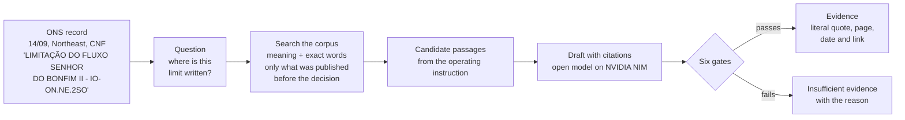
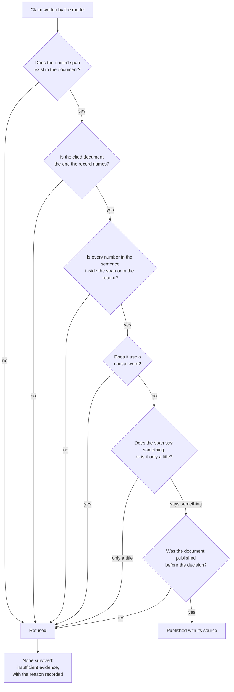
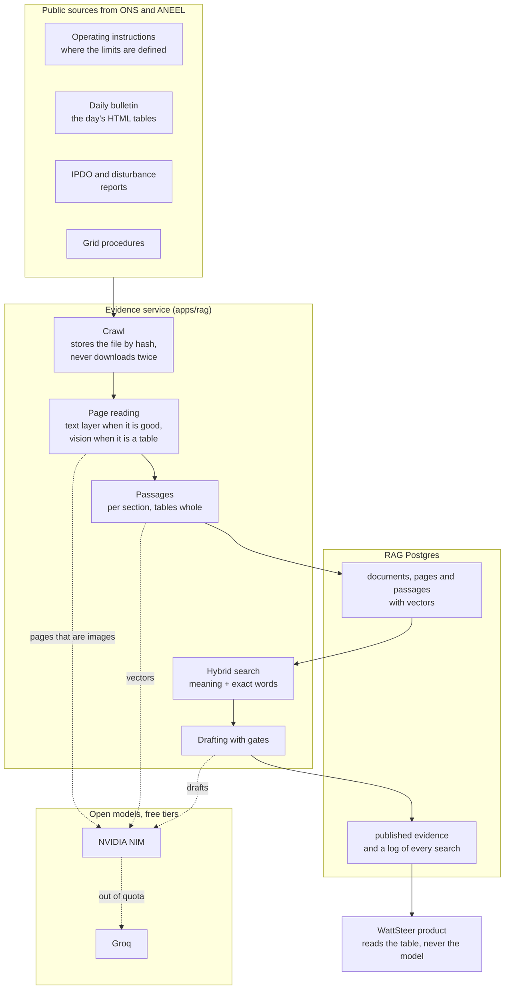

# The evidence behind a curtailment

On 14 September 2026, in the Northeast, the Brazilian system operator (ONS) cut
wind generation and recorded the reason like this:

> `Controle de inequação: LIMITAÇÃO DO FLUXO SENHOR DO BONFIM II - IO-ON.NE.2SO`

`IO-ON.NE.2SO` is an operating instruction: a public, 18 page document that
says how to operate the 230 kV Southwest area of the Northeast region. Its
section 5.1 is called "Limitação do Fluxo Senhor do Bonfim II", and that is
where the limit behind the cut is written down.

Between the record and the document there is a distance nobody walks. Someone
who follows the sector reads the code and moves on; someone who has to audit,
contest or explain the cut needs to know where that is written.

This is the WattSteer layer that walks that distance. For the record above it
returns:

> **Claim.** The document orders "Controlar a tensão de 230 kV da SE Senhor do
> Bonfim II, de acordo com os limites abaixo", to avoid voltage collapse under
> high generation and low load, in case of a single contingency on the 230 kV
> lines Juazeiro da Bahia II or Jaguarari.
>
> **Source.** IO-ON.NE.2SO, revision 146, section 5, published on 09/09/2026.

Two properties of that answer matter more than it looking right. The document
was published five days before the cut, so whoever decided could have known it.
And the sentence in quotes exists in the PDF: it is a copy, not a summary.



## The AI decides nothing here

Classifying a curtailment as external unavailability (REL), electrical
reliability (CNF) or energy reasons (ENE) is done by a rule and by a statistical
model, and it stays that way. The evidence layer comes after, and its whole job
is to find the document and copy the right passage.

This is not a matter of style. A system that opines on the cause of a cut
without being able to show where it is written does not enter a control room,
and does not survive an audit.

## Six gates, all mechanical

No claim exists before it passes these checks:

| Check | What it prevents |
| --- | --- |
| The quoted span must exist in the document, word for word | an invented quote |
| Every number in the sentence must be in the quoted span or in the record | an invented number |
| The cited document must be the one the record names | the right words about the wrong place |
| Causal vocabulary is forbidden | the AI ruling in place of the model |
| A section title on its own does not count | a citation that says nothing |
| Only documents published before the decision | explaining the past with future paper |



When nothing survives, the answer is "insufficient evidence", with the reason.
The system fails by staying silent, not by inventing.

There is one exception, and the answer itself declares it. Operating
instructions keep their limits in six column tables, where the cell that names
the control and the row that carries the numbers are never side by side. There
a quote may skip cells, as long as the pieces appear in the same order as in the
document, and it is marked as assembled. Reversing the order is still refused,
because reversing changes what the table says.

## The corpus

| Source | What it is | How much |
| --- | --- | --- |
| Operating instructions | where the limits are written | 6 documents, 116 pages |
| Grid procedures | the general rules the records cite | 8 submodules, 60 pages |
| Daily operation bulletin (BDO) | the day's numbers, as tables | 251 days, as HTML tables |
| IPDO | the day's preliminary report | 26 editions |
| Disturbance analysis report (RAP) | the analysis of one large event | 1 document |

That is 292 documents, 1,022 pages and 3,101 searchable passages.

The modest size is an informed choice, and the record says how modest it can be.
August 2026 alone holds 227,664 constrained-off rows for wind, and they use 61
distinct descriptions. One operating instruction, IO-ON.NE.5NE, accounts for
39,985 of those rows. The universe of documents that explains most cuts is small
and closed, and each new document covers many records at once.



## What the measurement shows

The test cases were not invented: each one is a curtailment record published by
the ONS, with the reason the operator declared, taken from the open
constrained-off record and ordered by the energy behind it.

Fourteen records of August 2026, measured on 16/09/2026:

| | |
| --- | --- |
| Records naming no document, all refused | 10 |
| Records naming an operating instruction | 4 |
| Of those, answered with a citation from that instruction | 1 |
| Answers citing a document the record did not name | 0 |

The ten refusals are the correct answer. Those records name an intervention
number, which is not public, or say "Controle de frequência do SIN", which names
nothing; there is no document to cite and the service says so.

The three refusals among the four that do name a document are the current
weakness, and they share a shape: the section is a step table — column headings
"Passo", "Coordenação", "Comando / execução", "Procedimento" — where the
sentence that states the rule is spread across cells, and a quote that survives
the literal check is hard to cut out of it.

The number that must not move is the last row. Before the relevance check
existed, a run reported six answers, and among them a record about the 500 kV
area of the Northeast was answered with the operating instruction for the
neighbouring area, written in almost the same words, and a flow control of
August 2026 was answered with the disturbance report of 15 August 2023. Both
quotes were literal, located and dated. Six wrong answers are worse than one
right one.

## The cost

Every model used is an open model on a free tier from NVIDIA or Groq. The system
also avoids spending where it does not need to: of the 816 pages read, 788 came
from the file's own text layer, and only 28 needed the vision model, precisely
the pages published as images.

Every team member can register a free key, and the quotas add up. When one
provider's quota is spent the request moves to the next one with the same
content; when all are spent the work is recorded as "waiting for quota" with
the time it can resume, and it resumes on its own. This happened while the
corpus was being built, and the indexing finished on the next run.

## The limits

**The IPDO has no official history.** The ONS publishes only the current
edition and replaces the previous one. History exists only in the public web
archive, and not everything there is usable: of 218 captures, 173 are the
document and the rest are the error page recorded after the file had already
been replaced.

**REL will rarely have documentary proof.** The intervention schedule is not
public. Evidence for external unavailability is limited to what the bulletins
mention, and its confidence is never declared high.

**The corpus covers part of the Northeast.** That is where most Brazilian
curtailment happens, and where the expansion continues.

## Checking without installing anything

1. The record, in the public WattSteer API:
   `https://api.wattsteer.com/v1/curtailment/reasons?subsystem=NE&date=2026-09-14`
2. The cited document: operating instruction IO-ON.NE.2SO, published in the
   Manual de Procedimentos da Operação on the ONS website.
3. Section 5 of the PDF, compared with the quote in the answer.

To reproduce the measurement, the commands are in `apps/rag/README.md`:

```
python eval/build_goldset.py --days 2026-09-14 2026-08-20
python eval/run_eval.py
```

## Glossary

- **Curtailment:** renewable energy that was generated and could not be used.
- **REL, CNF, ENE:** the reasons the ONS declares for a cut: external
  unavailability, electrical reliability and energy reasons.
- **IO (Instrução de Operação):** an ONS document that defines how to operate an
  area and which limits to respect.
- **SGI:** the record number of a scheduled intervention.
- **BDO and IPDO:** the daily bulletin and the preliminary daily report of the
  operation.
- **RAP:** the report that analyses a relevant disturbance.
- **RAG:** the technique where the machine first retrieves passages from real
  documents and only then writes, using only those passages.

Numbers measured on 15 and 16 September 2026.
