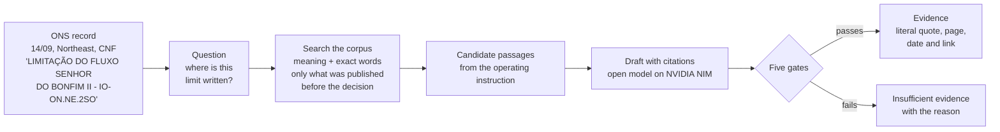
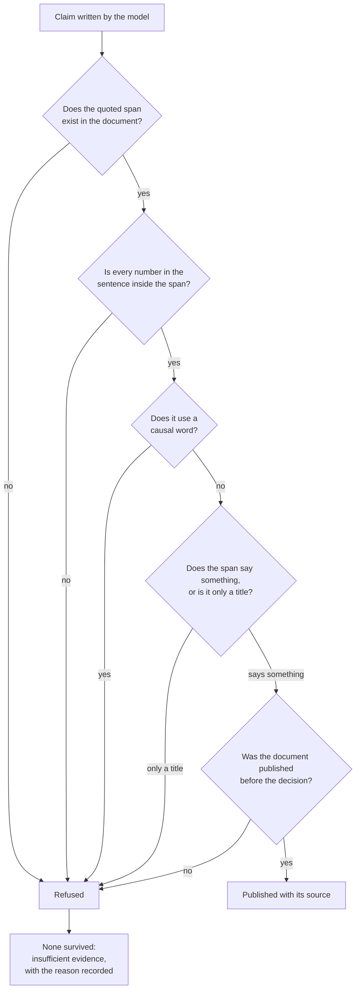
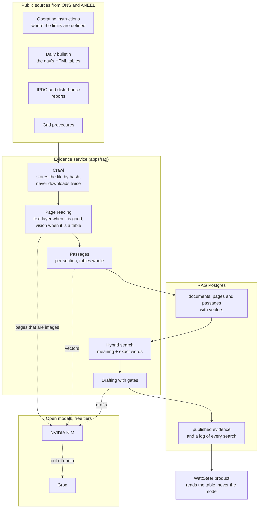

# The evidence behind a curtailment

On 14 September 2026, in the Northeast, the Brazilian system operator (ONS) cut
wind generation and recorded the reason like this:

> `Controle de inequação: LIMITAÇÃO DO FLUXO SENHOR DO BONFIM II - IO-ON.NE.2SO`

`IO-ON.NE.2SO` is an operating instruction: a public, 18 page document that
says how to operate the 230 kV Southwest area of the Northeast region. Its
section 5.1 is called "Limitação do Fluxo Senhor do Bonfim II", and that is
where the limit behind the cut is written down.

Between the record and the document there is a distance nobody walks. Someone
who follows the sector reads the code and moves on; someone who has to audit,
contest or explain the cut needs to know where that is written.

This is the WattSteer layer that walks that distance. For the record above it
returns:

> **Claim.** The document orders "Controlar a tensão de 230 kV da SE Senhor do
> Bonfim II, de acordo com os limites abaixo", to avoid voltage collapse under
> high generation and low load, in case of a single contingency on the 230 kV
> lines Juazeiro da Bahia II or Jaguarari.
>
> **Source.** IO-ON.NE.2SO, revision 146, section 5, published on 09/09/2026.

Two properties of that answer matter more than it looking right. The document
was published five days before the cut, so whoever decided could have known it.
And the sentence in quotes exists in the PDF: it is a copy, not a summary.



## The AI decides nothing here

Classifying a curtailment as external unavailability (REL), electrical
reliability (CNF) or energy reasons (ENE) is done by a rule and by a statistical
model, and it stays that way. The evidence layer comes after, and its whole job
is to find the document and copy the right passage.

This is not a matter of style. A system that opines on the cause of a cut
without being able to show where it is written does not enter a control room,
and does not survive an audit.

## Five gates, all mechanical

No claim exists before it passes these checks:

| Check | What it prevents |
| --- | --- |
| The quoted span must exist in the document, word for word | an invented quote |
| Every number in the sentence must be in the quoted span | an invented number |
| Causal vocabulary is forbidden | the AI ruling in place of the model |
| A section title on its own does not count | a citation that says nothing |
| Only documents published before the decision | explaining the past with future paper |



When nothing survives, the answer is "insufficient evidence", with the reason.
The system fails by staying silent, not by inventing.

There is one exception, and the answer itself declares it. Operating
instructions keep their limits in six column tables, where the cell that names
the control and the row that carries the numbers are never side by side. There
a quote may skip cells, as long as the pieces appear in the same order as in the
document, and it is marked as assembled. Reversing the order is still refused,
because reversing changes what the table says.

## The corpus

| Source | What it is | How much |
| --- | --- | --- |
| Operating instructions | where the limits are written | 6 documents, 93 pages |
| Grid procedures | the general rules the records cite | 4 submodules, 40 pages |
| Daily operation bulletin (BDO) | the day's numbers, as tables | 10 days, 250 tables |
| IPDO | the day's preliminary report | 19 editions |
| Disturbance analysis report (RAP) | the analysis of one large event | 1 document |

That is 281 documents, 816 pages and 2,786 searchable passages.

The modest size is an informed choice. Ten days sampled across the four
subsystems produced 857 curtailment records and only 17 distinct descriptions,
which point at three operating instructions. The universe of documents that
explains most cuts is small and closed, and each new document covers many
records at once.



## What the measurement shows

The test cases were not invented: each one is a curtailment record published by
the ONS, with the reason the operator declared. Out of seven records, four
received evidence, and 75% of those that named a document received a citation
from that document.

The variation has two known causes: how much of the corpus is indexed on the
machine where the measurement runs, and the fact that the model does not always
manage to copy a valid span from a table on the first attempt.

One refusal repeats in every run, and it is correct. The record "Controle de
frequência do SIN" has no document in this corpus that supports it, and the
honest answer for it is that there is insufficient evidence.

## The cost

Every model used is an open model on a free tier from NVIDIA or Groq. The system
also avoids spending where it does not need to: of the 816 pages read, 788 came
from the file's own text layer, and only 28 needed the vision model, precisely
the pages published as images.

Every team member can register a free key, and the quotas add up. When one
provider's quota is spent the request moves to the next one with the same
content; when all are spent the work is recorded as "waiting for quota" with
the time it can resume, and it resumes on its own. This happened while the
corpus was being built, and the indexing finished on the next run.

## The limits

**The IPDO has no official history.** The ONS publishes only the current
edition and replaces the previous one. History exists only in the public web
archive, and not everything there is usable: of 218 captures, 173 are the
document and the rest are the error page recorded after the file had already
been replaced.

**REL will rarely have documentary proof.** The intervention schedule is not
public. Evidence for external unavailability is limited to what the bulletins
mention, and its confidence is never declared high.

**The corpus covers part of the Northeast.** That is where most Brazilian
curtailment happens, and where the expansion continues.

## Checking without installing anything

1. The record, in the public WattSteer API:
   `https://api.wattsteer.com/v1/curtailment/reasons?subsystem=NE&date=2026-09-14`
2. The cited document: operating instruction IO-ON.NE.2SO, published in the
   Manual de Procedimentos da Operação on the ONS website.
3. Section 5 of the PDF, compared with the quote in the answer.

To reproduce the measurement, the commands are in `apps/rag/README.md`:

```
python eval/build_goldset.py --days 2026-09-14 2026-08-20
python eval/run_eval.py
```

## Glossary

- **Curtailment:** renewable energy that was generated and could not be used.
- **REL, CNF, ENE:** the reasons the ONS declares for a cut: external
  unavailability, electrical reliability and energy reasons.
- **IO (Instrução de Operação):** an ONS document that defines how to operate an
  area and which limits to respect.
- **SGI:** the record number of a scheduled intervention.
- **BDO and IPDO:** the daily bulletin and the preliminary daily report of the
  operation.
- **RAP:** the report that analyses a relevant disturbance.
- **RAG:** the technique where the machine first retrieves passages from real
  documents and only then writes, using only those passages.

Numbers measured on 15 and 16 September 2026.
