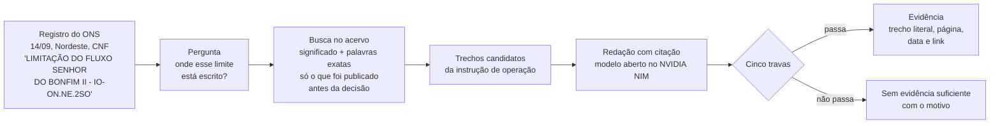
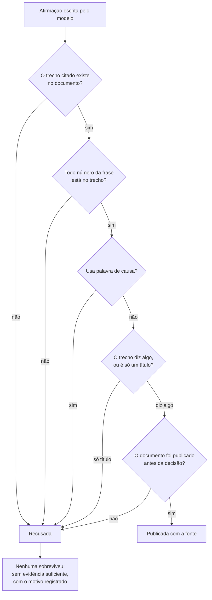
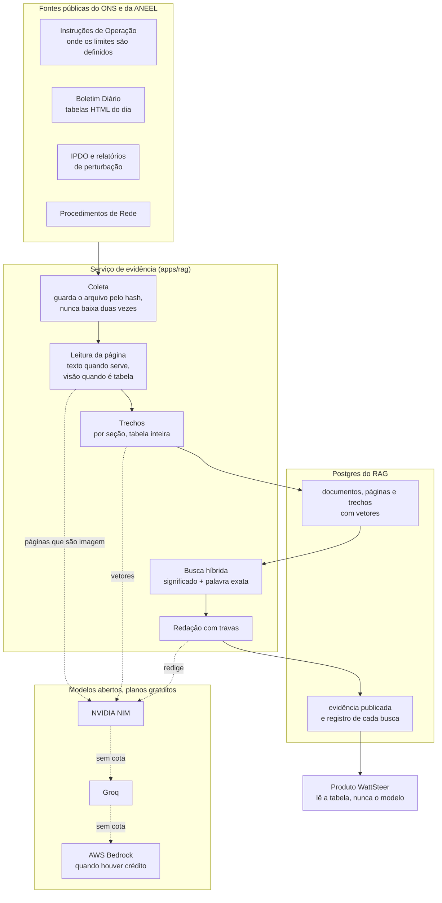

# A camada de evidência do WattSteer, explicada para qualquer pessoa

Este documento é para o time inteiro e para quem for avaliar o projeto. Não é
preciso saber programar para ler. Os números todos foram medidos em 15/09/2026 e
podem ser conferidos por quem quiser, com os comandos do fim.

## 1. O problema, em uma frase

Quando o operador do sistema elétrico corta geração eólica ou solar, ele registra
a razão em um texto curto. Esse texto cita documentos que quase ninguém abre.

Um registro real do dia 14/09/2026, no Nordeste:

> `Controle de inequação: LIMITAÇÃO DO FLUXO SENHOR DO BONFIM II - IO-ON.NE.2SO`

Para quem opera, isso é claro. Para qualquer outra pessoa, e para qualquer
auditoria, é uma sigla. `IO-ON.NE.2SO` é uma Instrução de Operação do ONS, um PDF
público de 18 páginas cuja seção 5.1 é exatamente "Limitação do Fluxo Senhor do
Bonfim II". É ali que está escrito o limite que motivou o corte.

## 1.1 O caminho de um registro, do corte à citação



O documento citado no exemplo, `IO-ON.NE.2SO`, é público e tem a seção 5.1
chamada exatamente "Limitação do Fluxo Senhor do Bonfim II".

## 2. O que a nossa camada de evidência faz

Ela pega o registro, encontra o documento que ele cita, e devolve **o trecho
exato, com página, data de publicação e link**. Nada além disso.

O que ela devolveu para o registro acima:

> **Afirmação:** o documento manda "Controlar a tensão de 230 kV da SE Senhor do
> Bonfim II, de acordo com os limites abaixo", para evitar colapso de tensão em
> cenários de elevada geração e carga reduzida, em caso de contingência simples
> das LT 230 kV Juazeiro da Bahia II ou Jaguarari.
>
> **Fonte:** IO-ON.NE.2SO, revisão 146, seção 5, publicada em 09/09/2026.

Repare em duas coisas. O documento foi publicado **antes** do dia do corte, então
era possível conhecê-lo na hora da decisão. E a frase citada existe no PDF: não é
um resumo, é uma cópia.

## 3. O que ela não faz, de propósito

- **Não decide a causa.** A classificação entre indisponibilidade externa (REL),
  confiabilidade elétrica (CNF) e razão energética (ENE) continua sendo da regra
  e do modelo. A evidência entra como apoio, com um peso declarado.
- **Não inventa número.** Todo número que aparece numa afirmação tem de estar
  dentro do trecho citado. Se não estiver, a afirmação é jogada fora.
- **Não explica o que aconteceu.** Ela diz o que o documento registra ou
  estabelece. Palavras de causa são proibidas por verificação automática.
- **Não responde sem prova.** Se nada passar nas verificações, a resposta é
  "sem evidência suficiente", com o motivo. O silêncio é o modo de falhar.

## 4. As cinco verificações, em linguagem simples

Toda resposta passa por estas travas antes de existir:

| Verificação | O que ela impede |
| --- | --- |
| O trecho citado tem de existir no documento, palavra por palavra | citação inventada |
| Todo número da frase tem de estar no trecho citado | número inventado |
| Vocabulário de causa é proibido | a IA dar veredito no lugar do modelo |
| Um título de seção sozinho não vale | citação que não diz nada |
| Só documentos publicados antes da decisão | explicar o passado com papel do futuro |

E a mesma coisa vista como decisão, uma afirmação de cada vez:



## 4.1 Uma observação honesta sobre citação em tabela

As instruções de operação guardam os limites em tabelas grandes. Ali, a evidência
que uma pessoa apontaria são duas partes da mesma tabela: a célula que nomeia o
controle e a linha que traz os números, que quase nunca ficam lado a lado. Exigir
um trecho contínuo seria recusar praticamente toda citação de tabela.

Então a regra é: em texto corrido, a citação tem de ser contínua; em tabela, ela
pode pular células, **desde que os pedaços apareçam na mesma ordem do documento**,
e a citação sai marcada como montada, para a tela poder dizer isso a quem lê.
Inverter a ordem continua sendo recusado, porque inverter muda o que a tabela diz.

## 5. O que já existe hoje

| Fonte | O que é | Quanto |
| --- | --- | --- |
| Instruções de Operação | onde os limites estão escritos | 6 documentos, 93 páginas |
| Procedimentos de Rede | as regras gerais que citamos | 4 submódulos, 40 páginas |
| Boletim Diário da Operação | os números do dia, em tabelas | 10 dias, 250 tabelas |
| IPDO | o informativo preliminar do dia | 19 edições |
| Relatório de Análise de Perturbação | a análise de um evento grande | 1 documento |

São 281 documentos, 816 páginas e **2.786 trechos** indexados e pesquisáveis.

Nada disso viaja dentro do repositório: quem instala constrói o acervo na própria
máquina, com um comando, e pode parar e retomar quando quiser.

**Teste com registros reais.** Montamos a avaliação a partir dos próprios
registros de corte publicados pelo ONS, não de perguntas inventadas: cada caso é
uma linha que o operador registrou, com a razão que ele declarou.

Em seis registros, medimos entre 4 e 5 respostas com evidência e 1 a 2 recusas,
com 75% a 100% dos registros que citam um documento recebendo a citação daquele
documento. O resultado varia com duas coisas, e as duas são honestas: quanto do
acervo está indexado na máquina onde se roda, e o fato de o modelo nem sempre
conseguir copiar um trecho válido de uma tabela na primeira tentativa.

Uma recusa se repete em todas as rodadas e está certa: o registro "Controle de
frequência do SIN" não tem, no nosso acervo, documento que o sustente. Recusar
ali é o comportamento desejado, não uma falha.

Qualquer pessoa pode repetir a medição na própria máquina:

```
python eval/build_goldset.py --days 2026-09-14 2026-08-20
python eval/run_eval.py
```

## 5.1 As peças, e por que elas estão onde estão



A seta pontilhada entre os modelos é o ponto que costuma passar despercebido: se
a cota gratuita de um acaba, o pedido vai para o próximo com o mesmo conteúdo, e
se todos acabarem o trabalho fica registrado como "aguardando cota" com a hora em
que pode continuar. Nada quebra, nada se perde.

## 6. Como isso custa quase nada

O sistema só usa modelos de inteligência artificial abertos, nas infraestruturas
da NVIDIA, da Groq e da AWS, todos em planos gratuitos. E ele evita gastar quando
não precisa: das 816 páginas lidas, 788 foram lidas de graça (o texto já estava
no arquivo) e só 28 precisaram do modelo de visão, que são justamente as páginas
publicadas como imagem.

Para funcionar, alguém precisa cadastrar uma chave gratuita da NVIDIA ou do Groq.
Isso é obrigatório e o instalador avisa em letras grandes se a chave faltar.

Quando a cota gratuita acaba, o serviço não quebra: ele registra "aguardando
cota" com a hora em que pode continuar, e retoma sozinho. Isso aconteceu de
verdade durante a construção, e a indexação terminou na rodada seguinte.

Cada integrante do time pode cadastrar a própria chave gratuita. O sistema soma
as cotas de todas e alterna entre elas. Com uma chave só, funciona igual.

## 7. Limitações que assumimos

- **O IPDO não tem histórico no ONS.** O órgão publica apenas a edição do dia e
  substitui a anterior. A história só existe no arquivo público da internet, e
  nem tudo que está lá serve: das 218 capturas encontradas, 173 são o documento
  e o resto é a página de erro que o arquivo gravou quando o arquivo já tinha
  sido trocado. Ficamos com as 173, de janeiro de 2018 a outubro de 2025.
- **REL raramente terá prova documental.** O cronograma de intervenções não é
  público, então a evidência para indisponibilidade externa fica limitada ao que
  os boletins mencionam, e a confiança nunca é declarada como alta.
- **O acervo ainda é pequeno.** Dois documentos normativos cobrem parte do
  Nordeste. A boa notícia é que dez dias amostrados nos quatro subsistemas
  tiveram 857 registros e apenas 17 descrições distintas: é um universo pequeno
  e fechado, e cada documento novo cobre muitos registros de uma vez.

## 8. Como conferir você mesmo

Sem instalar nada, qualquer pessoa pode abrir:

1. O registro do ONS, na nossa própria API:
   `https://api.wattsteer.com/v1/curtailment/reasons?subsystem=NE&date=2026-09-14`
2. O documento citado:
   a Instrução de Operação IO-ON.NE.2SO está publicada no site do ONS, no Manual
   de Procedimentos da Operação.
3. Comparar o trecho que mostramos com a seção 5 do PDF.

Quem quiser rodar o sistema encontra os comandos em `apps/rag/README.md`.

## 9. Glossário

- **Curtailment:** energia renovável que foi gerada e não pôde ser usada.
- **REL, CNF, ENE:** as razões que o ONS declara para um corte: indisponibilidade
  externa, confiabilidade elétrica e razão energética.
- **IO (Instrução de Operação):** documento do ONS que define como operar uma
  área e quais limites respeitar.
- **SGI:** número do registro de uma intervenção programada.
- **BDO e IPDO:** boletim diário e informativo preliminar da operação.
- **RAP:** relatório que analisa uma perturbação relevante.
- **RAG:** técnica em que a IA primeiro busca trechos de documentos reais e só
  depois escreve, usando apenas aqueles trechos.
