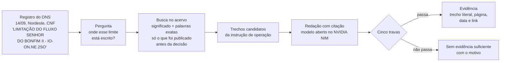
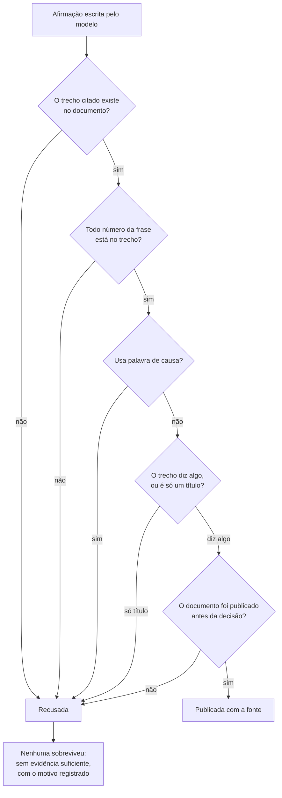
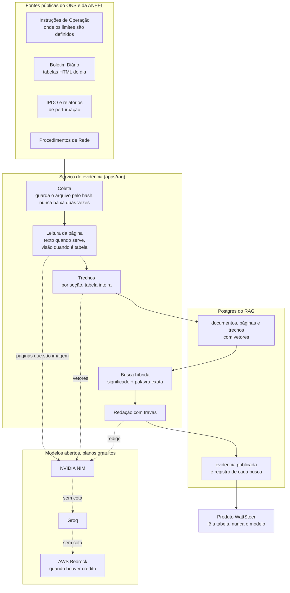

# A evidência por trás de um corte de geração

No dia 14 de setembro de 2026, no Nordeste, o Operador Nacional do Sistema
Elétrico cortou geração eólica e registrou a razão assim:

> `Controle de inequação: LIMITAÇÃO DO FLUXO SENHOR DO BONFIM II - IO-ON.NE.2SO`

`IO-ON.NE.2SO` é uma Instrução de Operação: um documento público de 18 páginas
que diz como operar a área 230 kV Sudoeste da região Nordeste. A seção 5.1 dele
chama-se "Limitação do Fluxo Senhor do Bonfim II" e é onde está escrito o limite
que motivou aquele corte.

Entre o registro e o documento existe uma distância que ninguém percorre. Quem
acompanha o setor lê a sigla e segue adiante; quem precisa auditar, contestar ou
explicar o corte precisa saber onde aquilo está escrito.

Esta é a camada do WattSteer que percorre essa distância. Para o registro acima,
ela devolve:

> **Afirmação.** O documento manda "Controlar a tensão de 230 kV da SE Senhor do
> Bonfim II, de acordo com os limites abaixo", para evitar colapso de tensão em
> cenários de elevada geração e carga reduzida, em caso de contingência simples
> das LT 230 kV Juazeiro da Bahia II ou Jaguarari.
>
> **Fonte.** IO-ON.NE.2SO, revisão 146, seção 5, publicada em 09/09/2026.

Duas propriedades dessa resposta importam mais do que ela parecer correta. O
documento foi publicado cinco dias antes do corte, então quem decidiu podia
conhecê-lo. E a frase entre aspas existe no PDF: é cópia, não resumo.



## A inteligência artificial não decide nada aqui

A classificação de um corte entre indisponibilidade externa (REL),
confiabilidade elétrica (CNF) e razão energética (ENE) é feita por regra e por
modelo estatístico, e continua sendo. A camada de evidência entra depois, e o seu
trabalho inteiro é achar o documento e copiar o trecho certo.

Isso não é uma escolha de estilo. Um sistema que opina sobre a causa de um corte
sem poder mostrar onde aquilo está escrito não entra numa sala de operação, e não
sobrevive a uma auditoria.

## Cinco travas, todas mecânicas

Nenhuma afirmação existe antes de passar por estas verificações:

| Verificação | O que ela impede |
| --- | --- |
| O trecho citado tem de existir no documento, palavra por palavra | citação inventada |
| Todo número da frase tem de estar no trecho citado | número inventado |
| Vocabulário de causa é proibido | a IA dar veredito no lugar do modelo |
| Um título de seção sozinho não vale | citação que não diz nada |
| Só documentos publicados antes da decisão | explicar o passado com papel do futuro |



Quando nada sobrevive, a resposta é "sem evidência suficiente", acompanhada do
motivo. O sistema erra calando, não inventando.

Há uma exceção, e ela é declarada na própria resposta. As instruções de operação
guardam os limites em tabelas de seis colunas, onde a célula que nomeia o
controle e a linha que traz os números nunca ficam lado a lado. Ali a citação
pode pular células, desde que os pedaços apareçam na mesma ordem do documento, e
sai marcada como montada. Inverter a ordem continua recusado, porque inverter
muda o que a tabela diz.

## O acervo

| Fonte | O que é | Quanto |
| --- | --- | --- |
| Instruções de Operação | onde os limites estão escritos | 6 documentos, 93 páginas |
| Procedimentos de Rede | as regras gerais que os registros citam | 4 submódulos, 40 páginas |
| Boletim Diário da Operação | os números do dia, em tabelas | 10 dias, 250 tabelas |
| IPDO | o informativo preliminar do dia | 19 edições |
| Relatório de Análise de Perturbação | a análise de um evento grande | 1 documento |

São 281 documentos, 816 páginas e 2.786 trechos pesquisáveis.

O tamanho modesto é uma escolha informada. Dez dias amostrados nos quatro
subsistemas produziram 857 registros de corte e apenas 17 descrições distintas,
que apontam para três instruções de operação. O universo de documentos que
explica a maior parte dos cortes é pequeno e fechado, e cada documento novo cobre
muitos registros de uma vez.



## O que a medição mostra

Os casos de teste não foram inventados: cada um é um registro de corte publicado
pelo ONS, com a razão que o operador declarou. Em seis registros, entre quatro e
cinco receberam evidência, e de 75% a 100% dos que citavam um documento
receberam a citação daquele documento.

A variação tem duas causas conhecidas: quanto do acervo está indexado na máquina
onde a medição roda, e o fato de o modelo nem sempre conseguir copiar um trecho
válido de uma tabela na primeira tentativa.

Uma recusa se repete em todas as rodadas, e está correta. O registro "Controle de
frequência do SIN" não tem, neste acervo, documento que o sustente, e a resposta
honesta para ele é dizer que não há evidência suficiente.

## O custo

Toda a inteligência artificial usada é de modelos abertos, em planos gratuitos da
NVIDIA, do Groq e da AWS. O sistema também evita gastar onde não precisa: das 816
páginas lidas, 788 vieram da camada de texto do próprio arquivo, e apenas 28
precisaram do modelo de visão, justamente as páginas publicadas como imagem.

Cada integrante da equipe pode cadastrar uma chave gratuita, e as cotas somam. Ao
esgotar a cota de um provedor, o pedido segue para o próximo com o mesmo
conteúdo; esgotadas todas, o trabalho fica registrado como "aguardando cota" com
a hora em que pode continuar, e retoma sozinho. Isso aconteceu durante a
construção do acervo, e a indexação terminou na rodada seguinte.

## Os limites

**O IPDO não tem histórico oficial.** O ONS publica apenas a edição do dia e
substitui a anterior. A história só existe no arquivo público da internet, e nem
tudo que está lá serve: das 218 capturas, 173 são o documento e as demais são a
página de erro registrada quando o arquivo já havia sido trocado.

**REL raramente terá prova documental.** O cronograma de intervenções não é
público. A evidência para indisponibilidade externa fica limitada ao que os
boletins mencionam, e a confiança nunca é declarada como alta.

**O acervo cobre parte do Nordeste.** É onde está a maior parte do curtailment
brasileiro, e é por onde a expansão continua.

## Conferindo sem instalar nada

1. O registro, na API pública do WattSteer:
   `https://api.wattsteer.com/v1/curtailment/reasons?subsystem=NE&date=2026-09-14`
2. O documento citado: a Instrução de Operação IO-ON.NE.2SO, publicada no Manual
   de Procedimentos da Operação, no site do ONS.
3. A seção 5 do PDF, comparada com o trecho da resposta.

Para reproduzir a medição, os comandos estão em `apps/rag/README.md`:

```
python eval/build_goldset.py --days 2026-09-14 2026-08-20
python eval/run_eval.py
```

## Glossário

- **Curtailment:** energia renovável que foi gerada e não pôde ser usada.
- **REL, CNF, ENE:** as razões que o ONS declara para um corte: indisponibilidade
  externa, confiabilidade elétrica e razão energética.
- **IO (Instrução de Operação):** documento do ONS que define como operar uma
  área e quais limites respeitar.
- **SGI:** número do registro de uma intervenção programada.
- **BDO e IPDO:** boletim diário e informativo preliminar da operação.
- **RAP:** relatório que analisa uma perturbação relevante.
- **RAG:** técnica em que a máquina primeiro busca trechos de documentos reais e
  só depois escreve, usando apenas aqueles trechos.

Números medidos em 15 de setembro de 2026.
